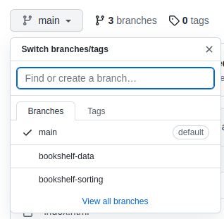

# Foundations.Assessment.BookshelfData

## Overview

This time around, you've been assigned to build out an entire web app: Bookshelf helps users keep track of all the books they've read and all the books they might want to read.

This assessment will test your ability to design classes that show a solid understanding of OOP best practices and build a small project given high level descriptions.

Refer to Canvas for more information as well as the rubric.

## Finding the Solutions

The solutions for each portion of this activity are separated into individual **branches**. To navigate to a branch, click the dropdown menu located near the top left corner of the repository's landing page on Github. The image below shows what your options will look like.

To switch to a branch and see the respective solution, you can select it in that dropdown menu.

| Branch Name       | Activity Name            |
| :---------------  | :----------------------- |
| main              | starter code             |
| bookshelf-data    | Bookshelf Data           |
| bookshelf-sorting | Bookshelf Sorting        |